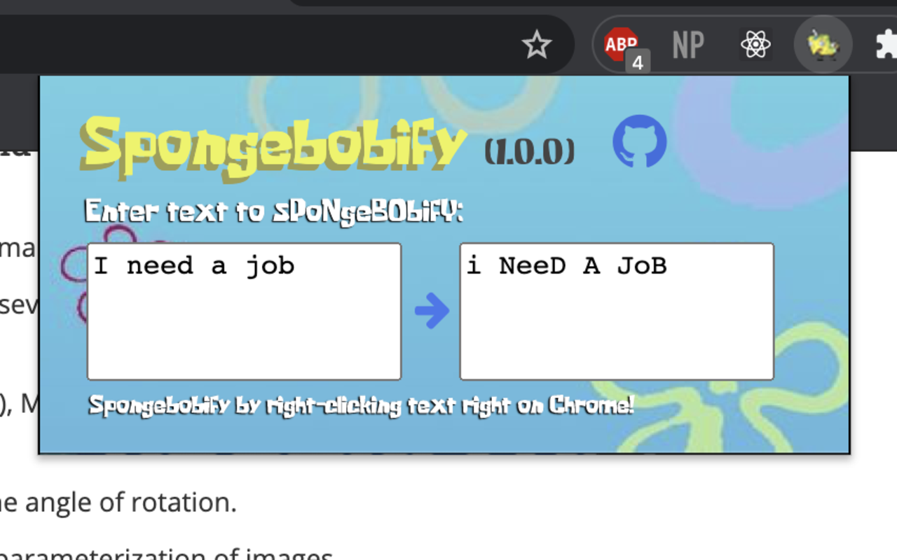
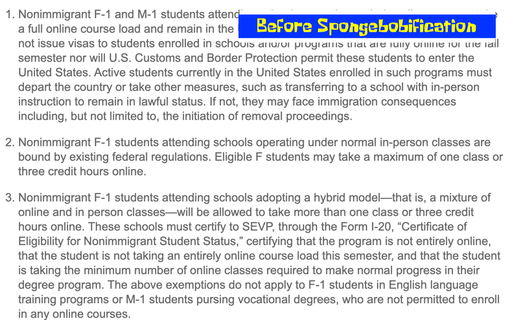
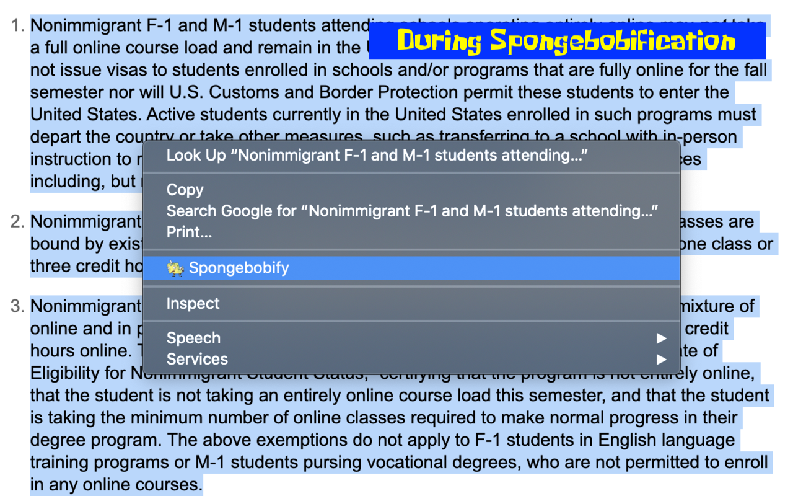
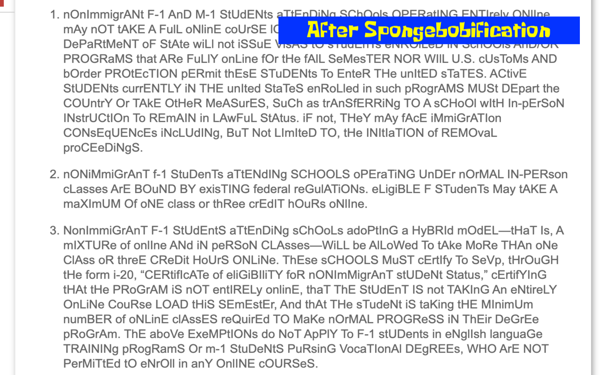

# Spongebobify Chrome extension

<a href= "https://chrome.google.com/webstore/detail/spongebobify/kjdlnkopbcdbnjcgipilmabafdoofiof?hl=en&authuser=2" target="_blank">Visit the extension on the Chrome store by clicking here</a>

**Application Status**

  

---

## How to use

First way to use is to open the popup window when you click on the extension in the browser. This prompts a window for you to copy and paste the text you need spongebobified:

Second way to use is to highlight whatever text you need spongebobified, right-clicking, then selecting "Spongebobify" through the Chrome context menu as such:

  

---

### Contribute

Contributions are always welcome! Make sure to pull into your local repository and submit a pull request to commit.

### Learn

Chrome extensions can be developed by anyone with Javascript knowledge. Hit me up if you have questions regarding Chrome extension development at nicholaswang2000@gmail.com. Feel free to use this code as a starting point for your project. That being said, please don't rip off the code.

---

### License

By me

---
